<h1 align="center">Hey, I'm Ivelin 👋</h1>

  <b>Frontend engineer at <a href="https://goodmorning.dev">goodmorning</a></b>, a Web3 dev studio 
  <i>Building tools for humans.</i>

  
  
  

  

---

<h2 align="center">Tech I work with</h2>

  
  
  
  
  
  
  
  
  

  
  
  
  
  
  
  

---

  <i>Open to a chat.</i> <a href="https://www.linkedin.com/in/ivelin-megdanov-57a41720b/">Say hi on LinkedIn</a> 🤝

